# 🏥 Healthcare Claim Management System

## 📌 Project Overview
The **Healthcare Claim Management System** is a comprehensive web-based platform built with **React.js** that streamlines healthcare claim processing between **Patients, Healthcare Providers, Hospitals, and Insurance Payors**.

### 🎯 Key Capabilities
- **Multi-Role Authentication** with secure login system including password visibility toggles and forgot password functionality
- **Real-time Dashboard Analytics** with interactive charts and claim status tracking
- **Role-Based Access Control** ensuring appropriate data access for each user type
- **Responsive Design** optimized for desktop and mobile devices
- **Advanced UI Components** with modern design patterns and animations

---

## 👥 Team Members (Team_2)
| Developers |
|-----------|
| **Deekshith H R** |
| **Manjunath M R** |
| **Sharath M** |
| **Srinivas R** |
| **Sagar H V** |

---

## 🚀 Features & Functionality

### 🔐 **Authentication System**
- **Secure Login** with email/password validation
- **Password Visibility Toggle** with eye icons for better UX
- **Forgot Password Flow** with email reset functionality
- **Multi-Role Support** for Patient, Provider, Hospital, and Payor access

### 📊 **Dashboard Analytics**
- **Interactive Charts** using Recharts library for data visualization
- **Real-time Statistics** showing claim counts, amounts, and trends
- **Role-Specific Views** tailored to each user type's needs
- **Monthly Reports** with bar charts and pie charts

### 🏥 **Role-Based Portals**

#### **Patient Dashboard**
- Track personal claim status and history
- View insurance coverage details
- Receive claim update notifications
- Access medical records and documents

#### **Provider Dashboard** 
- Submit new claims with medical documentation
- Monitor claim approval status and responses
- Manage patient information and treatment records
- View provider-specific analytics and reports

#### **Hospital Dashboard**
- Comprehensive patient management system
- Bulk claim processing capabilities
- Hospital-wide analytics and reporting
- Integration with provider workflows

#### **Payor Dashboard**
- Review and validate submitted claims
- Make approval decisions (Accepted/Partially Accepted/Rejected)
- Access claim processing analytics
- Manage payor policies and coverage rules

### 🔔 **Notification System**
- **Real-time Updates** on claim status changes
- **User Profile Management** with notification preferences
- **Email Alerts** for important claim updates
- **Dashboard Notifications** with integrated alert system

---

## 🛠️ Tech Stack

### **Frontend Architecture**
- **React.js 18** - Modern functional components with hooks
- **React Router DOM** - Client-side routing and navigation
- **Tailwind CSS** - Utility-first CSS framework for responsive design
- **Lucide React** - Modern icon library with 1000+ icons
- **Recharts** - Composable charting library for data visualization

### **Component Library**
- **Radix UI** - Headless UI components for accessibility
- **shadcn/ui** - Modern React component library (22+ components)
- **Custom UI Components** - Button, Card, Input, Label, Table, Tabs, Dialog, etc.

### **Development Tools**
- **Vite** - Fast build tool and development server
- **ESLint** - Code linting and quality assurance
- **PostCSS & Autoprefixer** - CSS processing and browser compatibility

### **State Management**
- **React Context API** - Authentication state management
- **useState & useEffect** - Local component state handling
- **Protected Routes** - Role-based access control

---

## 📊 System Workflow

```mermaid
graph TD
    A[Patient Visit] --> B[Provider Submits Claim]
    B --> C[Claim Routed to Payor]
    C --> D{Payor Review}
    D --> E[✅ Approved]
    D --> F[⚠️ Partially Approved]  
    D --> G[❌ Rejected]
    E --> H[Notification Sent]
    F --> H
    G --> H
    H --> I[Patient & Provider Updated]
```



1. **Patient Authentication** - Secure login with role verification
2. **Claim Submission** - Provider submits claim through dashboard
3. **Automated Routing** - System routes claim to appropriate payor
4. **Review Process** - Payor reviews claim with decision workflow
5. **Status Updates** - Real-time notifications to all stakeholders
6. **Analytics Tracking** - System captures metrics for reporting

---

## 🏗️ Project Structure

```
health-insurance-claims/
├── 📱 Frontend (React.js)
│   ├── src/
│   │   ├── components/
│   │   │   ├── LoginForm.jsx           # Authentication system
│   │   │   ├── Dashboard.jsx           # Main dashboard
│   │   │   ├── Header.jsx              # Navigation header
│   │   │   ├── ClaimDetails.jsx        # Claim processing
│   │   │   ├── NotificationsProfile.jsx # User notifications
│   │   │   ├── dashboards/             # Role-specific dashboards
│   │   │   │   ├── PatientDashboard.jsx
│   │   │   │   ├── ProviderDashboard.jsx
│   │   │   │   ├── HospitalDashboard.jsx
│   │   │   │   └── PayorDashboard.jsx
│   │   │   └── ui/                     # UI component library (22 components)
│   │   ├── context/
│   │   │   └── AuthContext.jsx         # Authentication context
│   │   ├── styles/
│   │   │   └── globals.css             # Global styling
│   │   └── App.jsx                     # Main application
│   ├── package.json                    # Dependencies
│   └── vite.config.js                  # Build configuration
└── 📚 Documentation
    ├── README.md                       # Project documentation
    ├── TEAM_SCHEDULE.md               # Development timeline
    └── GIT_WORKFLOW.md                # Collaboration guidelines
```

---

## 🎨 UI/UX Design & Development

### **Design System**
- **Modern Healthcare Theme** with professional color palette
- **Responsive Grid Layouts** optimized for all screen sizes
- **Accessibility First** with ARIA labels and keyboard navigation
- **Smooth Animations** with Tailwind CSS transitions

### **Component Architecture**
- **22 Reusable UI Components** built with Radix UI primitives
- **Consistent Design Patterns** across all dashboards
- **Theme Customization** with CSS variables and Tailwind config
- **Interactive Elements** with hover states and feedback

👉 **Figma Design Reference:**  
[Healthcare Claim Management UI Design](https://www.figma.com/make/OTM8p5BP2OCCXj99scpXkt/Health-Insurance-Claim-Login?node-id=0-1&p=f&t=in9AlxCc6VGRCDhj-0&fullscreen=1)

---

## 🚀 Getting Started

### **Prerequisites**
- Node.js 18+ and npm
- Git for version control
- Modern web browser

### **Installation**
```bash
# Clone the repository
git clone https://github.com/Deekshit7483/health-insurance-final-project.git
cd health-insurance-final-project

# Install dependencies
npm install

# Install React Router for navigation
npm install react-router-dom

# Start development server
npm run dev
```

### **Available Scripts**
```bash
npm run dev      # Start development server
npm run build    # Build for production
npm run preview  # Preview production build
npm run lint     # Run code linting
```

---

## 👨‍💻 Development Workflow

### **Git Workflow**
```bash
# Create feature branch
git checkout -b feature/component-name

# Make changes and commit
git add .
git commit -m "feat: component description - Developer Name"

# Push and create PR
git push origin feature/component-name
```

---

## 📈 Key Metrics & Analytics

### **Dashboard Features**
- **Real-time Claim Statistics** with live data updates
- **Monthly Trend Analysis** using interactive bar charts
- **Claim Status Distribution** with pie chart visualization
- **Performance Metrics** showing approval ratios and processing times

### **User Experience Metrics**
- **Responsive Design** across desktop, tablet, and mobile
- **Fast Load Times** with optimized React components
- **Accessibility Score** with WCAG 2.1 compliance
- **User Satisfaction** through intuitive navigation and feedback

---

## 🔐 Security Features

- **JWT Authentication** with secure token management
- **Role-Based Access Control** preventing unauthorized access
- **Protected Routes** with authentication verification
- **Data Validation** on all form inputs and API calls
- **Secure Password Handling** with visibility toggles and reset flows

---

## 📞 Contact & Support

For technical questions, feature requests, or collaboration opportunities:

| Team Member | Email/Contact |
|-------------|---------------|
| **Deekshith H R** |---------- |
| **Manjunath M R** | --------- |
| **Sharath M** | ------------- |
| **Srinivas R** | ------------ |
| **Sagar H V** | ------------- |

---

## 📜 License

This project is developed as part of academic coursework and is available for educational purposes.

---

## 🙏 Acknowledgments

- **React Community** for excellent documentation and ecosystem
- **Radix UI Team** for accessible component primitives  
- **Tailwind CSS** for the utility-first CSS framework
- **Lucide** for the beautiful icon library
- **Academic Institution** for project guidance and support

---

**Built with ❤️ by Team_2 - Healthcare Innovation through Technology**
